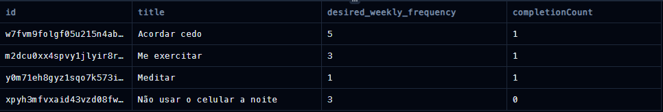

# Explicando as *querys* dessa aplicação

* Essa consulta SQL faz uma análise sobre metas criadas até uma determinada data e conta o número de vezes que essas metas foram completadas em um intervalo específico

<hr>

### 1. Buscando todas as metas criadas na semana atual

```sql
WITH "goals_created_up_to_week" AS (
  SELECT
      "id",
      "title",
      "desired_weekly_frequency",
      "created_at"
  FROM
      "goals"
  WHERE
      "goals"."created_at" <= '2024-09-15T02:59:59.999Z'
),
```

<hr>

### 2. Buscando lista de metas e quantas vezes elas foram completadas

```sql
"goal_completion_counts" AS (
  SELECT
      "goal_id",
      COUNT("id") AS "completionCount"
  FROM
      "goal_completions"
  WHERE
      "goal_completions"."created_at" >= '2024-09-08T03:00:00.000Z'
      AND "goal_completions"."created_at" <= '2024-09-15T02:59:59.999Z'
  GROUP BY
      "goal_completions"."goal_id"
)
```

<hr>

### 3. Agregando os resultados em uma *query* que retorna os resultados desejados utilizando as duas *querys* anteriores

```sql
SELECT
  "goals_created_up_to_week"."id",
  "goals_created_up_to_week"."title",
  "goals_created_up_to_week"."desired_weekly_frequency",
  COALESCE("completionCount", 0) AS "completionCount"
FROM
  "goals_created_up_to_week"
LEFT JOIN
  "goal_completion_counts"
ON
  "goal_completion_counts"."goal_id" = "goals_created_up_to_week"."id";
```

<hr>

### 4. Resultado obtido



## Explicação linha por linha:
**1. WITH `"goals_created_up_to_week"` AS (**
- `WITH`: É usado para criar uma CTE (Common Table Expression), que é uma subconsulta temporária que pode ser referenciada nas partes subsequentes da consulta.
- `"goals_created_up_to_week"`: Nome dado à CTE que estamos definindo.

**2. SELECT**
- Inicia a seleção de colunas na CTE.

**3. "id",**
- Seleciona a coluna `id` da tabela `"goals"`.

**4. "title",**
- Seleciona a coluna `title` da tabela `"goals"`.

**5. "desired_weekly_frequency",**
- Seleciona a coluna `desired_weekly_frequency` da tabela `"goals"`.

**6. "created_at"**
- Seleciona a coluna `created_at` da tabela `"goals"`.

**7. FROM "goals"**
- Especifica que a tabela de origem dos dados é a tabela `"goals"`.

**8. WHERE `"goals"`."created_at" <= '2024-09-15T02:59:59.999Z'**
- Aplica um filtro para selecionar apenas as linhas onde a coluna `created_at` é menor ou igual a `'2024-09-15T02:59:59.999Z'`.

**9. )**
- Finaliza a definição da CTE `"goals_created_up_to_week"`.

**10. "goal_completion_counts" AS (**
- Define outra CTE chamada `"goal_completion_counts"`.

**11. SELECT**
- Inicia a seleção de colunas na segunda CTE.

**12. "goal_id",**
- Seleciona a coluna `goal_id` da tabela `"goal_completions"`.

**13. COUNT("id") AS "completionCount"**
- Conta o número de registros para cada `goal_id` e nomeia essa contagem como `"completionCount"`.

**14. FROM "goal_completions"**
- Especifica que a tabela de origem dos dados é a tabela `"goal_completions"`.

**15. WHERE "goal_completions"."created_at" >= '2024-09-08T03:00:00.000Z'**
- Aplica um filtro para selecionar apenas os registros onde `created_at` é maior ou igual a `'2024-09-08T03:00:00.000Z'`.

**16. AND "goal_completions"."created_at" <= '2024-09-15T02:59:59.999Z'**
- E também que created_at é menor ou igual a `'2024-09-15T02:59:59.999Z'`.

**17. GROUP BY "goal_completions"."goal_id"**
- Agrupa os registros pelo `goal_id` para que o `COUNT` seja calculado para cada grupo de `goal_id`.

**18. )**
- Finaliza a definição da CTE `"goal_completion_counts"`.

**19. SELECT**
- Inicia a seleção final de dados, usando as CTEs definidas anteriormente.

**20. "goals_created_up_to_week"."id",**
- Seleciona a coluna id da CTE `"goals_created_up_to_week"`.

**21. "goals_created_up_to_week"."title",**
- Seleciona a coluna `title` da CTE `"goals_created_up_to_week"`.

**22. "goals_created_up_to_week"."desired_weekly_frequency",**
- Seleciona a coluna `desired_weekly_frequency` da CTE `"goals_created_up_to_week"`.

**23. COALESCE("completionCount", 0) AS "completionCount"**
- Usa a função `COALESCE` para garantir que, se `completionCount` for nulo, o valor retornado será `0`. Nomeia essa coluna como `"completionCount"`.

**24. FROM "goals_created_up_to_week"**
- Especifica que a seleção dos dados será feita a partir da CTE `"goals_created_up_to_week"`.

**25. LEFT JOIN "goal_completion_counts"**
- Realiza um LEFT JOIN com a CTE `"goal_completion_counts"`. Isso significa que todos os registros da CTE `"goals_created_up_to_week"` serão retornados, mesmo que não haja correspondência na CTE `"goal_completion_counts"`.

**26. ON "goal_completion_counts"."goal_id" = "goals_created_up_to_week"."id";**
- Define a condição de junção: a coluna `goal_id` da CTE `"goal_completion_counts"` deve corresponder à coluna `id` da CTE `"goals_created_up_to_week"`.
